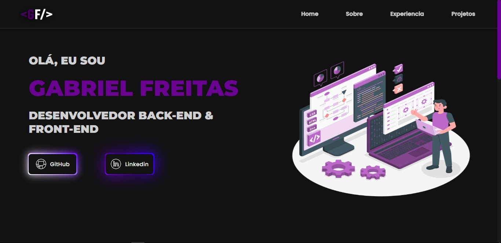

<h1 align="center">👨‍💻MY LANDING PAGE👨‍💻</h1>

    

## 🚀 Tecnologias

Esse projeto foi desenvolvido com as seguintes tecnologias:

- HTML e CSS
- JavaScript
- Git e Github
- Figma

## 💻 Projeto

O projeto tem por finalidade servir como um portifólio pessoal, em que apresento meus projetos de estudo e um pouco sobre mim, com a apresentação de currículo para possíveis entrevistas.

- [Acesse o projeto finalizado, online](gabrielfreitasc.github.io/devexperience/)

## 🖼 Layout

Você pode vizualizar o layout do projeto através [DESSE LINK](). é necessário ter conta no [Figma](https://figma.com) para acessa-lo.

---

Feito com ❤ by Gabriel Freitas - Siga-me no [Linkedin](https://www.linkedin.com/in/gabriel-freitasdev/)
